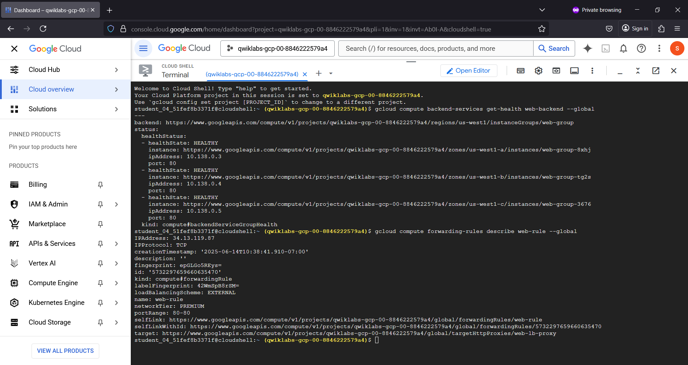
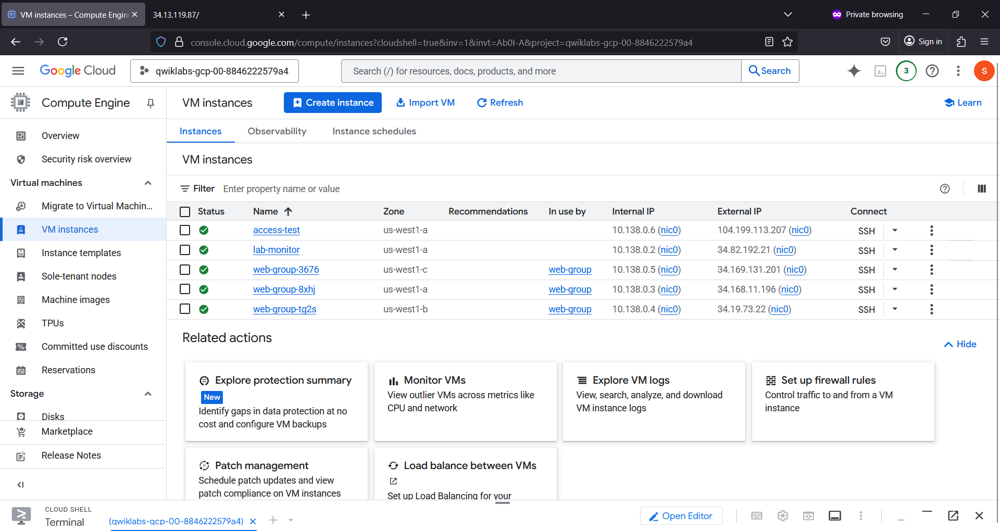
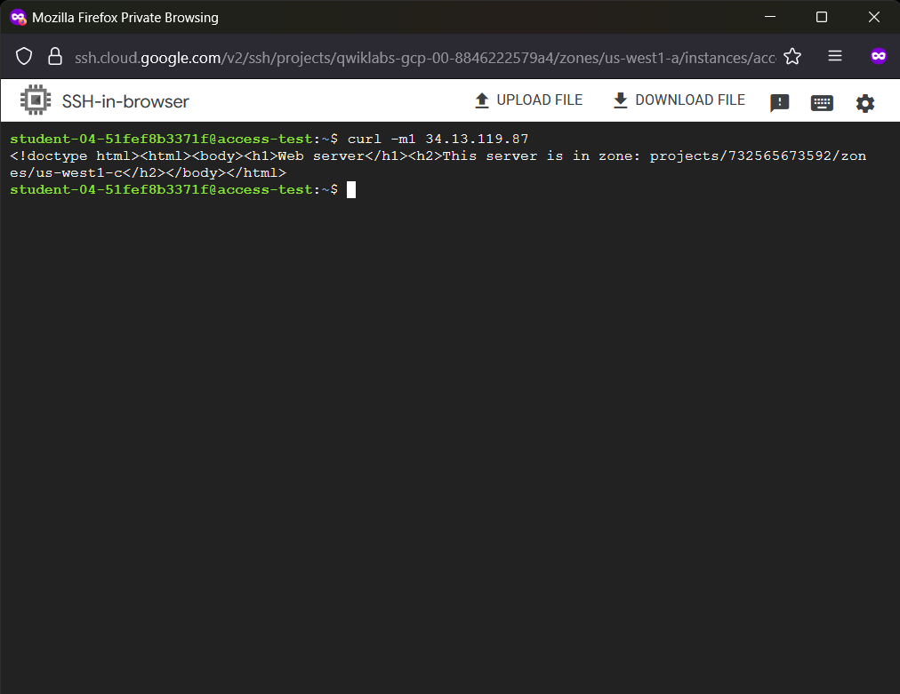
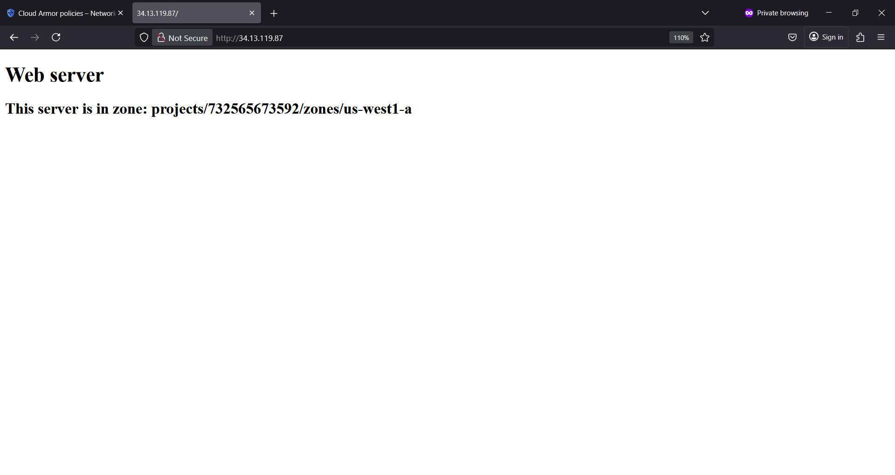
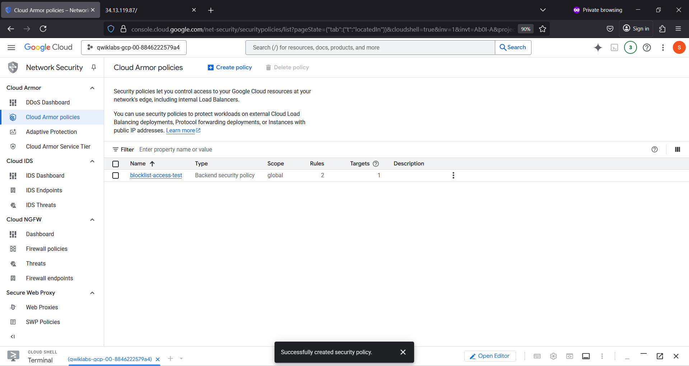
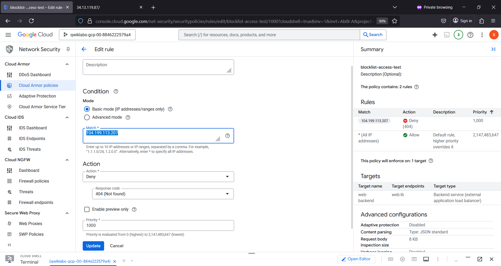
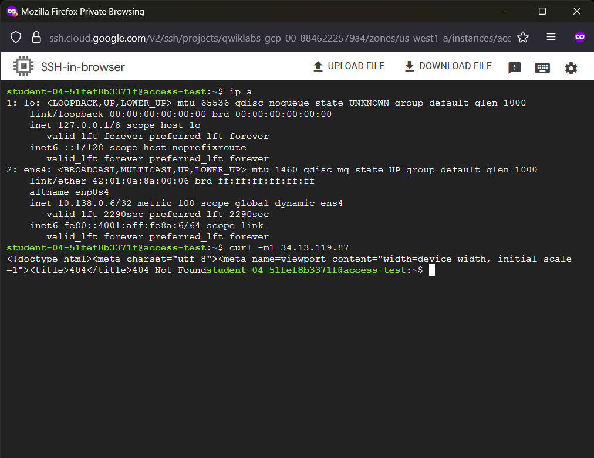
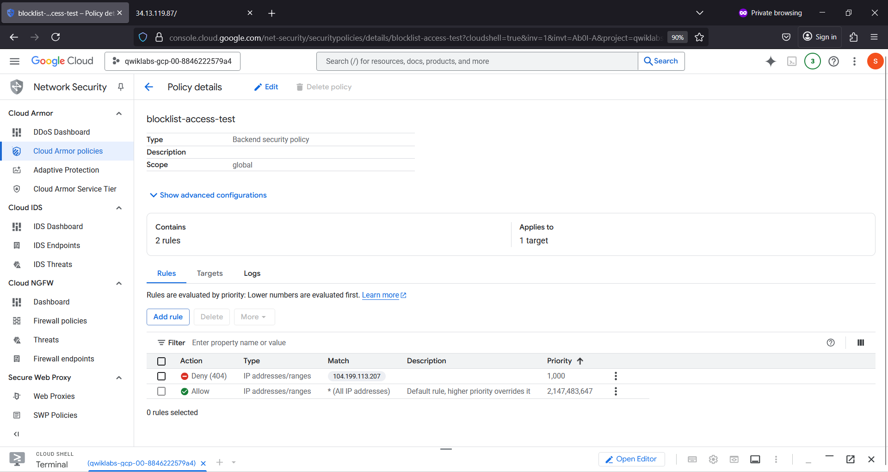
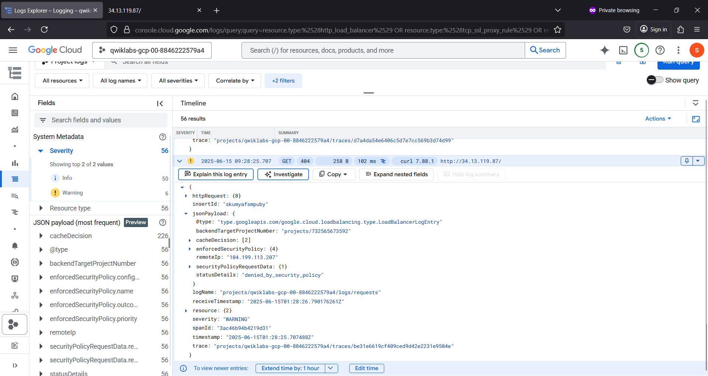
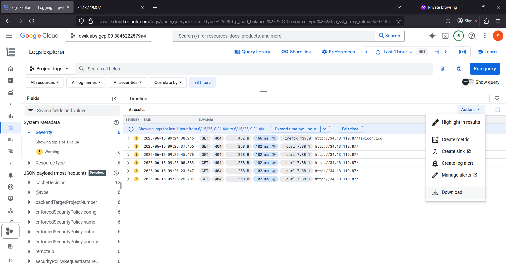

# netsec-cloud-armor 🛡️⚡
netsec-cloud-armor : Network Security # Cloud Armor # Load Balancer

## Objective
To create Google Cloud Armor security policy.
To blocklist IP address & restrict access to Application Load Balancer.

## Cloud Armor Network Security

